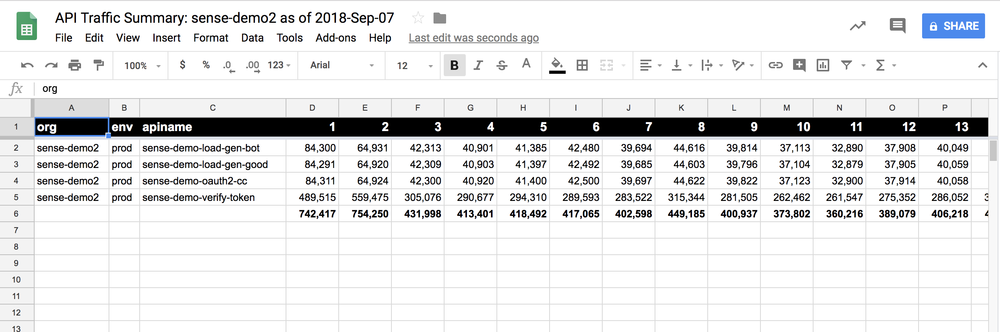
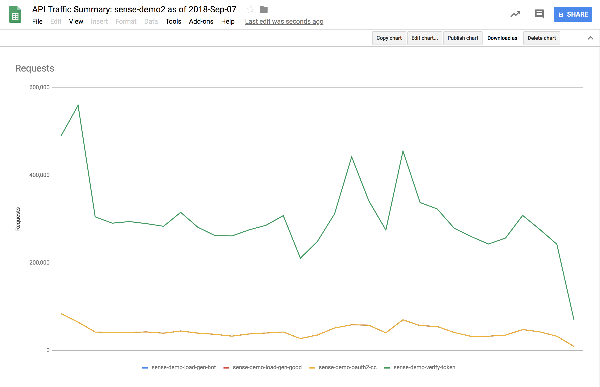

# Apigee Edge Traffic Summarizer

This tool queries the Edge Analytics API to retrieve message_count (traffic volume) statistics for an organization, over a given year.

There are two options for output:

- emit into a .csv file, which can then be imported into a Spreadsheet for further analysis.
- automatically generate a Google Sheet containing the data. This also generates charts.

## Disclaimer

This example is not an official Google product, nor is it part of an official Google product.

## LICENSE

This material is copyright 2018-2020 Google LLC.
and is licensed under the Apache 2.0 license. See the [LICENSE](LICENSE) file.

## Usage

```
$ node ./trafficByApiSummarizer.js
Apigee Edge Analytics Summarizer tool, version: 20201116-1619
Node.js v12.14.1

[2020-Nov-17 21:22:18] You must specify an organization
Usage:
  node trafficByApiSummarizer.js [OPTION]

Options:
  -M, --mgmtserver=ARG the base path, including optional port, of the Edge mgmt server. Defaults to https://api.enterprise.apigee.com .
  -u, --username=ARG   org user with permissions to read Edge configuration.
  -p, --password=ARG   password for the org user.
  -n, --netrc          retrieve the username + password from the .netrc file. In lieu of -u/-p
  -o, --org=ARG        the Edge organization.
  -Z, --ssoZone=ARG    specify the SSO zone to use when authenticating.
  -C, --passcode=ARG   specify the passcode to use when authenticating.
  -T, --notoken        do not try to obtain an oauth token.
  -v, --verbose
  -h, --help
  -P, --prior          optional. use the prior (N-1) year or month. Default: the current year/month.
  -d, --daily          optional. collect daily data for the period. Default: collect monthly data.
  -S, --sheet          optional. create a Google Sheet with the data. Default: emit .csv file.
      --start=ARG      optional. starting date in YYYYMMDD or YYYYMM format. Supercedes -P.
  -N, --nocache        optional. do not use cached data; retrieve from stats API
```

## Example 1

Generate a Google sheets document that summarizes the traffic volume data for
the current year, for an organization.

* option 1: prompt for password
  ```
  node ./trafficByApiSummarizer.js -v -u username@example.com -o my-org-name -S
  ```
* option 2: using .netrc
  ```
  node ./trafficByApiSummarizer.js -v -n -o my-org-name -S
  ```

In the first case, the script will prompt the user for an administrative
password to Apigee in order to query the Admin API.  In the second case the
script will use the credentials in the .netrc file for
api.enterprise.apigee.com.

In both cases, the user will separately be prompted to authenticate to Google, in order to
grant consent to the "API Traffic Summarizer" app to generate a
spreadsheet. Though the scope allows the tool to create and view sheets, the
tool merely creates a new sheet. It does not read any existing sheets stored in
Google drive.

The tool will perform several queries to the /stats API for Apigee, then with
the resulting data, will create a spreadsheet with 2 sheets and 2 charts; one sheet will
list the "per API Proxy" traffic volumes, and one will summarize the traffic by
environment. Then 2 charts corresponding to the data in those sheets.







This can take a long time to run, if there's lots of data. You may want to use the -v option to see
verbose output.


## Example 2

Generate a Google sheets document that summarizes the traffic volume data since
July 2017, for an organization.

```
node ./trafficByApiSummarizer.js -n -v -o my-org-name  -S --start 201707
```


## Example 3

Generate a .csv file that summarizes the traffic volume data for the current
year, for an Edge organization.

```
 node ./trafficByApiSummarizer.js -n -o my-org-name
```


When you invoke the program without the -S option, a .csv file is emitted, and
no Google sheets document is created. The .csv file includes the raw "per API
proxy" data. It does not include a rollup of "per environment".  Again, this
can take a long time to run.


## Example 4

Generate a .csv file that summarizes the traffic volume data, by month, for the prior year (-P) for an Edge organization.


```
 node ./trafficByApiSummarizer.js -n -o my-org-name -P
```

## Example 5

Generate a google sheet that summarizes the traffic volume data, by day, for the prior month, for an organization.

```
 node ./trafficByApiSummarizer.js -n -o my-org-name -d -P -S
```


## Bugs

none?
